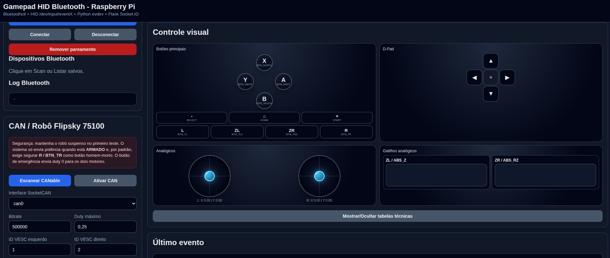

# PandoraPi — Gamepad Bluetooth + CAN Flipsky + LiDAR + GPS A76XX + Depth Camera + Follow Autônomo

Aplicação web que transforma um Raspberry Pi em uma central de controle para robôs com tração diferencial usando controladores **Flipsky 75100 (VESC)** conectados via barramento **CAN**. O comando é feito por **gamepad Bluetooth HID** (Nintendo Switch Pro Controller ou qualquer controle compatível com evdev). **LiDAR LDROBOT STL-06P** integrado como radar de navegação com nuvem de pontos 2D persistente (time-decay de 3 segundos). **GPS via modem SIMCom A76XX LTE** com visualização em mapa Leaflet, constelação de satélites em canvas, gravação de trajeto com exportação GPX/JSON, upload de rota GPX e navegação autônoma (follow) com desvio de obstáculos via LiDAR. **Depth Camera Orbbec Astra Pro** com streaming de profundidade colorizada (colormap JET) via `ob_depth.py` (wrapper ctypes). **Freio regenerativo** no botão B (`CAN_PACKET_SET_CURRENT_BRAKE`, 8A configurável).

Todo o sistema roda como um único script Python (~7000 linhas) — Flask + Socket.IO no backend, HTML/CSS/JS inline no frontend, leitura de gamepad via `evdev`, envio de quadros CAN raw via SocketCAN, leitura serial do LiDAR e modem GPS via `pyserial`, e câmera depth via `ob_depth.py` (ctypes wrapper para libOrbbecSDK.so).



## Hardware necessário

| Componente | Detalhes |
|---|---|
| Raspberry Pi | Com Bluetooth integrado (ou dongle USB) |
| CANable | Adaptador USB-CAN com firmware **candleLight** (recomendado). Com firmware slcan, é necessário configurar `slcand` manualmente antes de usar |
| 2× Flipsky 75100 VESC | IDs CAN 1 (motor esquerdo) e 2 (motor direito) |
| Gamepad Bluetooth | Nintendo Switch Pro Controller (testado) ou qualquer controle HID reconhecido pelo kernel Linux via evdev |
| LiDAR LDROBOT STL-06P | Conectado via USB serial (aparece como `/dev/ttyUSB0`). Baud rate 230400 |
| SIMCom A76XX LTE Module | Modem com GNSS integrado (GPS, GLONASS, Galileo, BeiDou). Aparece como `/dev/ttyUSB0-3`. GPS via comandos AT em `/dev/ttyUSB1` a 115200 baud |
| Orbbec Astra Pro | Câmera 3D depth via USB. Captura 640×480 @ 30fps Y16. Wrapper ctypes em `ob_depth.py` sobre `libOrbbecSDK.so` (SDK incluso em `OrbbecSDK/lib/arm64/`). Colormap JET via OpenCV |

## Como funciona

```
Navegador (http://IP_DO_PI:5005)
        │
        ▼ Socket.IO (WebSocket)
┌───────────────────────────────┐
│         Flask Server          │
│  - Rotas REST de configuração │
│  - Socket.IO para eventos     │
│    em tempo real              │
├───────────────────────────────┤
│  Thread: gamepad_reader_loop  │
│  Lê /dev/input/eventX (evdev) │──► Gamepad Bluetooth (HID)
│  Emite eventos via Socket.IO  │
├───────────────────────────────┤
│  Thread: gps_reader_loop       │
│  Abre /dev/ttyUSB1 (pyserial)  │──► Modem A76XX
│  AT+CGNSSPWR=1, AT+CGNSSINFO=1 │    GNSS (GPS/GLONASS/Galileo/BeiDou)
│  Parse +CGNSSINFO, emite S.IO  │
├───────────────────────────────┤
│  Thread: depth_camera_loop     │
│  ob_depth.py (ctypes)          │──► Orbbec Astra Pro
│  Depth→colormap JET→JPEG→S.IO  │    (640×480 @ 30fps)
├───────────────────────────────┤
│  Thread: lidar_reader_loop    │
│  Lê /dev/ttyUSB0 (pyserial)   │──► LiDAR LDROBOT STL-06P
│  Protocolo 0x54, CRC, 230400  │
│  Emite nuvem pontos via S.IO  │
├───────────────────────────────┤
│  CAN / SocketCAN (PF_CAN)     │
│  Envia quadros CAN estendidos │──► CANable ──► Flipsky VESC 1 + 2
│  com duty cycle (-1.0 a 1.0)  │
└───────────────────────────────┘
```

### Matemática dos motores

```
throttle = ABS_Y  (analógico esquerdo, cima/baixo)
steering = ABS_X  (analógico esquerdo, esquerda/direita)

left  = (throttle + steering × steering_gain) × max_duty
right = (throttle - steering × steering_gain) × max_duty
```

Os valores são saturados entre `[-1.0, 1.0]` e multiplicados pelo `max_duty` configurável. O botão homem-morto (`BTN_TR` / botão R) precisa estar pressionado para enviar qualquer potência aos motores.

### Radar LiDAR — persistência visual (time-decay)

Os pontos do LiDAR acumulam por **3 segundos** com fading progressivo. Cada ponto recebe um timestamp no recebimento e sua opacidade decai linearmente:

```
alpha = alpha_base × (1 - idade_ms / 3000)

0s: 100% opaco (cor viva)
1s: 66% opaco
2s: 33% opaco
3s: removido
```

Isso cria um **"rastro" visual** ao redor do robô, permitindo ao operador enxergar obstáculos mesmo quando o feixe do LiDAR não está apontando diretamente para eles. Anéis de perigo (50cm vermelho tracejado, 1m laranja tracejado) indicam zonas de alerta. O card mostra a distância do obstáculo mais próximo em tempo real.

O sistema funciona **sem odometria** — assume que o robô se move devagar o suficiente para o histórico de 3 segundos ainda ser útil. Para maior precisão com o robô em movimento rápido, seria necessário dead reckoning via encoders (não implementado).

### GPS A76XX — Streaming AT + Parser CGNSSINFO

O modem SIMCom A7670E-MASA usa chipset **ASR** com comandos AT proprietários:

```
AT+CGNSSPWR=1           # liga o chip GNSS
AT+CGNSSINFO=1          # inicia streaming contínuo de posição
```

A resposta `+CGNSSINFO:` contém 19 campos em formato fixo:

```
+CGNSSINFO: 3,15,,05,07,44.2737427,N,9.5367308,E,100526,152328.00,360.2,4.984,89.12,2.63,1.39,2.23,10
           fix gps glo bd ga  lat    NS lng   EW  date  utc      alt speed hdg pdop hdop vdop tdop sats
```

O parser `parse_cgnssinfo()` extrai: modo do fix (0/2/3D), latitude/longitude em graus decimais, altitude (m), velocidade (km/h), rumo (graus), satélites por constelação (GPS, GLONASS, BeiDou, Galileo), HDOP/PDOP/VDOP/TDOP.

### Freio regenerativo (botão B / BTN_SOUTH)

O botão **B** (BTN_SOUTH no Pro Controller) envia o comando `CAN_PACKET_SET_CURRENT_BRAKE` (ID 2) com **8A** de corrente de freio para ambos os VESCs. O freio funciona mesmo sem o deadman pressionado — segurança sobreposta.

```
B pressionado → CAN_PACKET_SET_CURRENT_BRAKE 8A ambos VESCs
B solto       → CAN_PACKET_SET_CURRENT_BRAKE 0A (libera freio)

Payload: int32 big-endian, escala A × 1000
CAN ID: (2 << 8) | vesc_id
```

Configurável via `can.brake_button` (padrão `BTN_SOUTH`) e `can.brake_current` (padrão `8.0` A, range 0–200A).

### Upload de trajeto GPX

Arquivos **.gpx** (GPS Exchange Format) podem ser carregados via botão **📂 Upload GPX**. O parser `parse_gpx_xml()` extrai os `<trkpt>` de `<trkseg>`, suportando namespace GPX 1.1. O trajeto carregado aparece como polyline **vermelha** no mapa Leaflet, ao lado do trajeto sendo gravado (verde). O botão **🗑 Limpar mapa** remove ambos.

Formatos suportados: GPX 1.1 com `<trkpt lat="..." lon="...">`, opcionalmente `<ele>`, `<time>`.

### Seguir trajeto (Follow autônomo)

O robô pode seguir automaticamente um trajeto GPX carregado, navegando por waypoints usando GPS + bússola:

```
A cada ciclo GPS (1 Hz):
  1. current = (gps_state.lat, gps_state.lng)
  2. target  = uploaded_trajectory[next_waypoint]
  3. distance = haversine(current, target)          # metros
  4. bearing  = bearing_to(current, target)          # graus 0-360
  5. hdg_error = angle_diff(bearing, gps.heading)    # -180 a +180
  6. steering = clamp(hdg_error × steering_kp, -1, 1)
  7. throttle = min(max_auto_speed, distance × 0.04)
  8. if distance < waypoint_threshold → próximo waypoint
  9. último waypoint → follow_stop()
```

**Requisitos:** robô armado + fix GPS ≥ 2 (3D) + trajeto GPX carregado. Configurável via `follow_config`: `waypoint_threshold` (2m), `max_auto_speed` (0.15), `steering_kp` (0.5).

### Desvio de obstáculos (LiDAR durante Follow)

Durante o follow autônomo, o **LiDAR** é usado para detectar e desviar de obstáculos em tempo real:

```
18 setores de 10° no semicírculo frontal (-90° a +90°):
  • Obstáculo < safe_distance_mm (50cm) → força repulsiva proporcional
  • Obstáculo < critical_distance_mm (30cm) nos setores frontais → PARADA EMERGÊNCIA
  • Setores esquerdos empurram steering → direita (+)
  • Setores direitos empurram steering → esquerda (-)

steering_final = path_steering × (1 - weight) + avoidance_steering × weight
throttle_final = throttle_path × (dist_front / safe_distance)  [se obstáculo à frente]
```

Configurável na interface: distância segura (cm), distância crítica (cm), checkbox toggle. O robô **para imediatamente** se algo entrar a menos de 30cm na frente, e **reduz velocidade** proporcionalmente se obstáculo estiver entre 30cm e 50cm.

### Depth Camera Orbbec Astra Pro

A câmera 3D Orbbec Astra Pro é integrada via wrapper ctypes (`ob_depth.py`) sobre `libOrbbecSDK.so`:

```
DepthCamera (ob_depth.py)
  → DepthStream 640×480 Y16 (uint16, mm)
  → numpy clip [min_mm, max_mm] + normalize 0-255
  → OpenCV applyColorMap(JET)
  → JPEG encode (quality 60) → base64
  → Socket.IO "depth_frame" a ~10 fps
```

O card na interface mostra a imagem colorizada em tempo real com escala de cores (perto=vermelho, médio=amarelo, longe=verde, muito longe=azul), métricas de FPS e distâncias min/max configuráveis.

### Gravação de trajeto

O trajeto é armazenado em memória durante a gravação. Cada ponto contém:

```json
{"lat": 44.2737, "lng": 9.5367, "alt": 360.2, "speed_kmh": 4.98, "heading": 89.12, "utc_time": "152328.00", "epoch": 1746891130.123}
```

Funções disponíveis: **Iniciar**, **Pausar**, **Retomar**, **Parar**. O download está disponível em dois formatos:
- **GPX 1.1** (`trajectory_to_gpx()`) — padrão universal, compatível com Google Earth, Strava, Garmin, OSMAnd, QGIS
- **JSON** (`trajectory_to_json()`) — formato nativo com metadados (tempo de início/fim, total de pontos, distância total calculada via Haversine)

## Dependências

### Sistema (pacotes apt)

| Pacote | Uso | Obrigatório |
|---|---|---|
| `python3 python3-pip` | Runtime Python | Sim |
| `bluetooth bluez` | Stack Bluetooth + `bluetoothctl` | Sim (gamepad) |
| `kmod` | `modprobe` / `modinfo` (módulos HID) | Sim |
| `iproute2` | `ip link` (ativar interface CAN) | Sim |
| `sudo` | Escalação de privilégios (CAN, serial) | Sim |
| `can-utils` | `candump`, `cansend` (diagnóstico CAN) | Recomendado |
| `evtest` | Teste de dispositivos de entrada | Recomendado |
| `joystick` | Utilitários de joystick | Recomendado |
| `usbutils` | `lsusb` (depuração USB) | Recomendado |
| `libusb-1.0-0` | Dependência nativa do Orbbec SDK (`libob_usb.so`) | Somente Depth Camera |

```bash
# Instalação completa (todos os componentes)
sudo apt install -y python3 python3-pip bluetooth bluez kmod iproute2 sudo \
  can-utils evtest joystick usbutils libusb-1.0-0

# Instalação mínima (gamepad + CAN, sem periféricos)
sudo apt install -y python3 python3-pip bluetooth bluez kmod iproute2 sudo
```

### Módulos do kernel

| Módulo | Função | Quando carregar |
|---|---|---|
| `hidp` | HID sobre Bluetooth | Obrigatório para gamepad |
| `hid-nintendo` | Driver Nintendo Switch Pro Controller | Obrigatório para Pro Controller |
| `can` / `can_raw` | Subsistema SocketCAN | Carregado automaticamente pelo `ip link` |

```bash
sudo modprobe hidp
sudo modprobe hid-nintendo
# Os módulos CAN (can, can_raw, can_dev) são carregados automaticamente
# ao executar "sudo ip link set can0 up type can bitrate 500000"
```

> Se `hid-nintendo` não existir no seu kernel, atualize o kernel ou use outro gamepad HID genérico.

### Python (pip)

| Pacote | Uso | Obrigatório |
|---|---|---|
| `flask` | Framework web | Sim |
| `flask-socketio` | WebSocket / eventos em tempo real | Sim |
| `evdev` | Leitura de gamepad (`/dev/input/eventX`) | Sim (gamepad) |
| `pyserial` | Comunicação serial (LiDAR + GPS A76XX) | Sim (LiDAR/GPS) |
| `numpy` | Processamento de arrays (colormap depth) | Somente Depth Camera |
| `opencv-python` | Colormap JET + compressão JPEG | Somente Depth Camera |

```bash
# Instalação completa (todos os componentes)
pip install flask flask-socketio evdev pyserial numpy opencv-python

# Instalação mínima (gamepad + CAN, sem LiDAR/GPS/Depth)
pip install flask flask-socketio evdev
```

> Cada componente é importado sob `try/except` — se faltar, o subsistema correspondente é desabilitado sem quebrar o resto. `pyserial` é necessário para LiDAR e GPS. `numpy` e `opencv-python` são necessários para a câmera depth (colormap + JPEG).

### Depth Camera (Orbbec Astra Pro)

A câmera requer o SDK Orbbec (clonado no projeto) e `ob_depth.py` (já incluso):

```bash
# O SDK já está em OrbbecSDK/ (clonado do GitHub)
# As bibliotecas nativas estão em lib/arm64/
# O wrapper Python está em ob_depth.py

# Verificar se a câmera é reconhecida:
python3 -c "
from ob_depth import DepthCamera
cam = DepthCamera()
cam.start()
frame = cam.get_frame()
print(f'OK: {frame.shape}')
cam.close()
"
```

> A câmera depth só funciona em **Raspberry Pi (aarch64/arm64)**. Em x86_64, `ob_depth.py` exibe um erro claro de arquitetura.

## Como rodar

```bash
# Dentro da pasta do projeto
sudo python gamepad_web_can_flipsky.py
```

> **Por que sudo?** O script precisa executar `ip link set can0 up type can bitrate 500000` para ativar a interface CAN **e** acessar a porta serial `/dev/ttyUSB0` do LiDAR. Se for usar apenas o gamepad sem CAN/LiDAR, pode rodar como usuário normal desde que esteja no grupo `input`:
>
> ```bash
> sudo usermod -aG input $USER
> sudo usermod -aG dialout $USER   # para acesso serial (LiDAR)
> sudo reboot
> ```

Acesse no navegador: **http://<IP_DO_RASPBERRY>:5005**

Na inicialização o script exibe no terminal todas as instruções de dependências, diagnóstico e comandos úteis.

## Uso passo a passo

### 1. Conectar o gamepad via Bluetooth

1. Abra a página no navegador
2. Na seção **Bluetooth**: clique em **Power ON**
3. Clique em **Preparar Agent** (isso carrega os módulos HID, registra o agent NoInputNoOutput e ativa discoverable/pairable)
4. Coloque o controle em modo de pareamento (no Pro Controller, segure o botão pequeno de sync)
5. Clique em **Scan 8 segundos** para encontrar dispositivos
6. Encontre seu controle na lista e clique em **Parear + Trust + Conectar**
7. O controle deve aparecer como **conectado** na seção Status

### 2. Verificar o gamepad

- A seção **Controle visual** mostra em tempo real todos os analógicos, botões, D-Pad e gatilhos
- Os LEDs do gamepad indicam conexão ativa (no Pro Controller, o LED inferior acende)
- Use a aba **Mapeamento rápido** para associar botões/eixos a nomes de ação

### 3. Ativar o LiDAR

1. Conecte o LiDAR LDROBOT STL-06P via USB — ele aparece como `/dev/ttyUSB0`
2. Na seção **LiDAR LDROBOT STL-06P**: verifique a porta serial
3. Clique em **Salvar config** para aplicar
4. Se o LiDAR estiver funcionando, o canvas mostrará a nuvem de pontos 2D
5. A métrica **Mais proximo** mostra a distância do obstáculo mais próximo
6. Anéis vermelho (50cm) e laranja (1m) indicam zonas de perigo ao redor do robô

### 4. Ativar a Depth Camera (Opcional)

1. Conecte a Orbbec Astra Pro via USB
2. O card **Depth Camera Orbbec Astra Pro** mostra a imagem depth colorizada
3. Ajuste as distâncias mínima e máxima conforme necessário
4. A escala de cores: vermelho = perto, amarelo = médio, verde = longe, azul = muito longe

### 5. Ativar o GPS A76XX

1. Conecte o modem SIMCom A76XX via USB — ele aparece como `/dev/ttyUSB0` a `/dev/ttyUSB3`
2. O GPS liga automaticamente ao iniciar o servidor (`AT+CGNSSPWR=1` → `AT+CGNSSINFO=1`)
3. A seção **GPS A76XX + Trajeto** mostra fix, coordenadas, satélites, mapa e controles
4. Para gravar um trajeto: clique em **Iniciar**, pilote o robô, **Pausar/Retomar** conforme necessário, **Parar** ao finalizar
5. Clique em **Baixar GPX** para exportar no formato universal, ou use o botão **Limpar mapa** para resetar

### 6. Navegação autônoma (Seguir trajeto)

1. Clique em **Upload GPX** e selecione um arquivo `.gpx` com a rota desejada
2. A rota aparece como polyline **vermelha** no mapa
3. Ajuste as distâncias de segurança (cm) para o desvio de obstáculos
4. Verifique que o checkbox **🛡️ Desviar de obstáculos (LiDAR)** está ativo
5. Com o robô **armado** e GPS com **fix 3D**, clique em **Seguir trajeto**
6. O robô navega automaticamente pelos waypoints, desviando de obstáculos
7. Clique em **Parar** a qualquer momento para retomar controle manual

### 7. Configurar e ativar o CAN

1. Na seção **CAN / Robô Flipsky 75100**: clique em **Escanear CANable**
2. Selecione a interface (geralmente `can0`), confira o bitrate (500000)
3. Clique em **Ativar CAN** — isso executa `ip link set can0 up type can bitrate 500000`
4. Ajuste os parâmetros:
   - **Duty máximo**: comece com `0.25` (25%) e aumente com cuidado
   - **Ganho direção**: `0.65` é um bom equilíbrio
   - **Botão homem-morto**: por padrão `BTN_TR` (botão R do Pro Controller)
5. Clique em **ARMAR robô**

### 8. Controlar o robô

1. Com o robô **armado**, segure o botão homem-morto (R) e mova o analógico esquerdo
2. Cima/baixo = acelerar/ré; esquerda/direita = girar
3. Os valores de duty esquerdo e direito aparecem em tempo real na seção CAN
4. Soltar o botão homem-morto **corta imediatamente** a potência (envia duty 0)
5. Use o **radar LiDAR** no canto direito para visualizar obstáculos ao redor
6. Acompanhe a posição GPS e grave o trajeto na seção **GPS A76XX + Trajeto**
7. Pressione **B** para freio regenerativo (funciona mesmo sem deadman)
8. Use a **Depth Camera** para visualizar obstáculos em 3D com o colormap JET

### 9. Parada de emergência

- O botão **PARADA DE EMERGÊNCIA** desarma o robô e envia `duty = 0` para ambos os motores imediatamente
- Use isso se o robô se comportar de forma inesperada

## Interface web — seções

### Coluna esquerda (controles)

| Seção | Função |
|---|---|
| **Status** | Conexão HID, nome do dispositivo, contagem de botões/eixos/eventos |
| **Bluetooth** | Power ON/OFF, preparar agent, scan, listar dispositivos, parear/conectar/remover por MAC |
| **CAN / Robô** | Escanear CANable, ativar interface, armar/desarmar, parada de emergência, parâmetros do VESC |
| **Dispositivos HID** | Listar /dev/input/event*, selecionar path fixo, filtrar por nome, deadzone |
| **Mapeamento rápido** | Associar códigos de botão/eixo a nomes de ação personalizados |
| **Mapeamentos salvos** | Tabela com todos os mapeamentos, clique para editar |

### Coluna direita (visualização)

| Seção | Função |
|---|---|
| **LiDAR LDROBOT STL-06P** | Canvas 420×420px com nuvem de pontos 2D persistente (3s fading). Anéis de perigo 50cm/1m. Métricas: conexão, nº pontos, obstáculo mais próximo, RPM, FPS. Legendas de cor por distância |
| **Depth Camera Orbbec Astra Pro** | Imagem depth 640×480 com colormap JET em tempo real (~10 fps). Métricas: conexão, FPS, distância mínima/máxima. Inputs para ajustar range de profundidade. Legenda de cores (perto/medio/longe/muito longe) |
| **GPS A76XX + Trajeto** | Mapa Leaflet com OpenStreetMap, marcador de posição (azul), polyline do trajeto gravado (verde) e trajeto carregado (vermelho). Métricas: fix (NONE/2D/3D), satélites usados/visíveis, HDOP, lat/lng, altitude, velocidade, rumo, UTC. Canvas de constelação de satélites. Controles de gravação: Iniciar/Pausar/Retomar/Parar. Download GPX/JSON, Upload GPX, Limpar mapa, Ligar/Desligar GPS, Seguir trajeto. Log próprio |
| **Controle visual** | Gamepad visual interativo (compacto): botões A/B/X/Y, D-Pad, analógicos (sticks), gatilhos (triggers), L/R/ZL/ZR, SELECT/HOME/START |
| **Último evento** | JSON do último evento recebido do gamepad |
| **Tabelas técnicas** | Lista detalhada de todos os botões e eixos (dentro do Controle visual, toggle) |
| **Log em tempo real** | Últimos 300 eventos de gamepad + ações do usuário |

## Configuração

Toda a configuração é salva automaticamente em `gamepad_config.json` (mesmo diretório do script). Ao rodar pela primeira vez, o arquivo é criado com valores padrão.

```json
{
  "device_path": "",
  "device_name_contains": "",
  "deadzone": 0.05,
  "mappings": {},
  "can": {
    "interface": "can0",
    "bitrate": 500000,
    "left_id": 1,
    "right_id": 2,
    "max_duty": 0.25,
    "steering_gain": 0.65,
    "send_interval": 0.05,
    "throttle_axis": "ABS_Y",
    "steering_axis": "ABS_X",
    "invert_throttle": true,
    "invert_steering": false,
    "invert_left": false,
    "invert_right": true,
    "require_deadman": true,
    "deadman_button": "BTN_TR",
    "brake_button": "BTN_SOUTH",
    "brake_current": 8.0
  },
  "lidar": {
    "port": "/dev/ttyUSB0",
    "baudrate": 230400,
    "min_distance": 150,
    "max_distance": 12000,
    "emit_interval": 0.08
  },
  "gps": {
    "at_port": "/dev/ttyUSB1",
    "at_baudrate": 115200,
    "emit_interval": 1.0
  },
  "depth_camera": {
    "enabled": true,
    "min_depth_mm": 500,
    "max_depth_mm": 8000,
    "emit_fps": 10
  }
}
```

### Parâmetros CAN

| Parâmetro | Padrão | Descrição |
|---|---|---|
| `interface` | `can0` | Nome da interface SocketCAN |
| `bitrate` | `500000` | Taxa do barramento (125k, 250k, 500k, 1M) |
| `left_id` | `1` | ID CAN do VESC esquerdo (0-255) |
| `right_id` | `2` | ID CAN do VESC direito (0-255) |
| `max_duty` | `0.25` | Duty cycle máximo (0.01 a 0.95). Aumente com cuidado |
| `steering_gain` | `0.65` | Quanto o steering influencia a diferença entre motores (0 a 1) |
| `throttle_axis` | `ABS_Y` | Eixo usado para acelerar/ré |
| `steering_axis` | `ABS_X` | Eixo usado para direção |
| `invert_throttle` | `true` | Inverte o acelerador (normalmente ABS_Y vai negativo ao empurrar pra cima) |
| `invert_steering` | `false` | Inverte direção |
| `invert_left` | `false` | Inverte o motor esquerdo |
| `invert_right` | `true` | Inverte o motor direito |
| `require_deadman` | `true` | Exige botão homem-morto pressionado |
| `deadman_button` | `BTN_TR` | Botão homem-morto (R no Pro Controller) |
| `send_interval` | `0.05` | Intervalo mínimo entre envios CAN (em segundos) |
| `brake_button` | `BTN_SOUTH` | Botão do freio regenerativo (B no Pro Controller) |
| `brake_current` | `8.0` | Corrente de freio em Amperes (0–200) |

### Parâmetros LiDAR

| Parâmetro | Padrão | Descrição |
|---|---|---|
| `port` | `/dev/ttyUSB0` | Porta serial do LiDAR |
| `baudrate` | `230400` | Baud rate (STL-06P usa 230400) |
| `min_distance` | `150` | Distância mínima de detecção (mm). Pontos abaixo disso são ignorados |
| `max_distance` | `12000` | Distância máxima de detecção (mm). Pontos acima são ignorados |
| `emit_interval` | `0.08` | Intervalo mínimo entre envios de frame para o frontend (segundos) |

### Parâmetros GPS

| Parâmetro | Padrão | Descrição |
|---|---|---|
| `at_port` | `/dev/ttyUSB1` | Porta serial para comandos AT e streaming GPS (ttyUSB0-3 do modem) |
| `at_baudrate` | `115200` | Baud rate da porta AT |
| `emit_interval` | `1.0` | Intervalo mínimo entre atualizações de status (segundos) |

### Parâmetros Depth Camera

| Parâmetro | Padrão | Descrição |
|---|---|---|
| `enabled` | `true` | Habilita/desabilita a câmera depth na inicialização |
| `min_depth_mm` | `500` | Distância mínima do colormap (mm). Abaixo disso = vermelho |
| `max_depth_mm` | `8000` | Distância máxima do colormap (mm). Acima disso = azul escuro |
| `emit_fps` | `10` | Taxa de envio de frames para o frontend (3–30) |

### Parâmetros Follow (navegação autônoma)

| Parâmetro | Padrão | Descrição |
|---|---|---|
| `waypoint_threshold` | `2.0` | Distância (m) para considerar waypoint atingido |
| `max_auto_speed` | `0.15` | Duty cycle máximo no modo autônomo (0–1) |
| `steering_kp` | `0.5` | Ganho proporcional do controle de direção |
| `avoidance_weight` | `0.5` | Blend entre path following e obstacle avoidance (0=só path, 1=só desvio) |
| `safe_distance_mm` | `500` | Distância (mm) abaixo da qual começa a desviar de obstáculos |
| `critical_distance_mm` | `300` | Distância (mm) abaixo da qual ocorre parada de emergência |
| `avoidance_enabled` | `true` | Habilita/desabilita desvio de obstáculos via LiDAR |

### Filtro de dispositivos HID

- **`device_path`**: caminho fixo para um `/dev/input/eventX` específico (ex: `/dev/input/event4`)
- **`device_name_contains`**: filtra dispositivos cujo nome contém o termo (ex: `Pro Controller`)
- **`deadzone`**: zona morta dos analógicos (0.0 a 0.5)

> Se ambos estiverem preenchidos, `device_path` tem prioridade.

### Mapeamentos

Os mapeamentos associam códigos de botão/eixo a nomes de ação que aparecem na interface. Exemplos:

```
BTN_SOUTH    → Freio
BTN_NORTH    → Farol
ABS_RZ       → Velocidade máxima
```

## Diagnóstico e troubleshooting

### Bluetooth conecta mas gamepad não aparece

```bash
cat /proc/bus/input/devices          # O controle aparece?
ls -l /dev/input/event*              # Existem dispositivos de input?
modinfo hid-nintendo                 # Módulo existe?
sudo modprobe hidp                   # Carregar módulo HID
sudo modprobe hid-nintendo           # Carregar driver Nintendo
```

Também use o botão **Diagnóstico HID** na interface web — ele mostra `/proc/bus/input/devices`, dispositivos evdev, e status dos módulos.

### Permissão negada ao acessar /dev/input/eventX

```bash
sudo usermod -aG input $USER
sudo reboot
```

### LiDAR não aparece / porta serial não encontrada

```bash
ls -l /dev/ttyUSB*                   # A porta aparece?
ls -l /dev/ttyACM*                   # Alguns adaptadores usam ttyACM
sudo usermod -aG dialout $USER       # Permissão para porta serial
sudo reboot
dmesg | grep -i usb                  # Verificar se o kernel reconheceu o dispositivo
```

O status do LiDAR aparece no card (OFF → ON quando conectado). Se mostrar `pyserial nao disponivel`:

```bash
pip install pyserial
```

### GPS não mostra dados

```bash
ls -l /dev/ttyUSB*                   # O modem aparece?
sudo picocom -b 115200 /dev/ttyUSB1  # Testar comandos AT
AT+CGNSSPWR?                         # Verificar se GPS está ligado
AT+CGNSSINFO                         # Consultar posição manualmente
sudo cat /dev/ttyUSB3                # Verificar se tem NMEA em outra porta
```

### Depth Camera não conecta

```bash
lsusb | grep -i orbbec               # Câmera reconhecida pelo kernel?
python3 -c "from ob_depth import DepthCamera; DepthCamera()"  # Testar wrapper
```

> A câmera só funciona em **Raspberry Pi (aarch64/arm64)**. Em x86_64, `ob_depth.py` exibe "Execute no Raspberry Pi". Verifique também que o SDK foi clonado com `git clone` na raiz do projeto.

### Freio regenerativo não funciona

```bash
# Verificar se o VESC responde ao comando de brake (via CAN)
# O botão B (BTN_SOUTH) precisa estar mapeado corretamente
# Verifique no painel visual se o botão B acende ao pressionar
```

### CAN não funciona

```bash
ip -details link show can0           # Interface existe?
sudo ip link set can0 up type can bitrate 500000   # Ativar manualmente
candump can0                         # Verificar tráfego
```

Certifique-se de que o CANable está com firmware **candleLight** (não slcan). Com firmware slcan, o adaptador aparece como `/dev/ttyACM*` e precisa do `slcand` para criar a interface CAN.

### Erro "evdev não disponível"

```bash
pip install evdev
# ou
sudo apt install python3-evdev
```

## Segurança

- **Nunca teste com o robô no chão na primeira vez** — mantenha-o suspenso
- Comece com `max_duty` baixo (0.10 a 0.25) e aumente gradualmente
- O botão homem-morto (`BTN_TR` / R) **precisa** estar segurado para qualquer movimento
- A **PARADA DE EMERGÊNCIA** desarma o robô e zera o duty de ambos os motores
- Sempre tenha um kill switch físico nos VESCs como redundância
- O LiDAR é **apenas visualização** — não interfere no controle do robô. O operador é responsável por desviar de obstáculos
- O GPS é um modem SIMCom A76XX — certifique-se de que a porta AT configurada corresponde à porta correta do modem
- O **freio regenerativo** (botão B) funciona mesmo sem deadman — é uma camada extra de segurança
- O **follow autônomo** requer robô armado + fix GPS 3D. O **obstacle avoidance** para o robô automaticamente se detectar obstáculo a menos de 30cm na frente

## Arquitetura do código

O projeto é um **monolito de arquivo único** (~7000 linhas) + `ob_depth.py` (wrapper ctypes, ~160 linhas) contendo:

```
pandorapi/
├── gamepad_web_can_flipsky.py   ← arquivo principal (~7000 linhas)
├── ob_depth.py                   ← wrapper ctypes p/ Orbbec Astra Pro
├── OrbbecSDK/                    ← SDK Orbbec (clonado, .gitignored)
│   └── lib/arm64/*.so            ← bibliotecas nativas ARM
├── lib/arm64/                    ← backup das .so
├── assets/screenshot.png
├── README.md
└── gamepad_config.json           ← config gerada automaticamente

gamepad_web_can_flipsky.py
├── Configuração (DEFAULT_CONFIG, load/save)
├── Mapeamento de códigos evdev (CODE_FALLBACK_NAMES, FRIENDLY_NAMES)
├── HTML_PAGE (template inline com CSS + JS completo)
├── Funções auxiliares de sistema (módulos, /proc, /dev/input)
├── Gamepad reader (evdev, normalização de eixos, eventos)
├── GPS reader (pyserial, AT commands, parse CGNSSINFO, trajeto)
├── GPS follow + obstacle avoidance (haversine, bearing, LiDAR sectors)
├── GPX parser/export (parse_gpx_xml, trajectory_to_gpx)
├── Depth Camera reader (ctypes wrapper, colormap JET, JPEG base64)
├── LiDAR reader (pyserial, protocolo LDROBOT 0x54, CRC, parse)
├── Bluetooth (bluetoothctl interativo via subprocess.Popen)
├── CAN / SocketCAN (PF_CAN socket, duty, current brake, quadros estendidos)
├── Lógica do robô (deadman, brake, throttle+steering→duty left/right)
├── Rotas Flask (~45 endpoints REST + Socket.IO)
└── Entry point (4 threads + socketio.run na porta 5005)
```

### Threads

- **Main thread**: servidor Flask + Socket.IO
- **gamepad_reader_loop** (daemon): loop infinito lendo eventos do `/dev/input/eventX`, reconectando automaticamente se o dispositivo sumir
- **gps_reader_loop** (daemon): abre porta AT, envia `AT+CGNSSPWR=1` + `AT+CGNSSINFO=1`, faz parsing contínuo de `+CGNSSINFO:`, emite status, grava trajeto e executa follow autônomo com obstacle avoidance
- **depth_camera_loop** (daemon): abre câmera depth via `ob_depth.py` (ctypes), captura frames 640×480 Y16, aplica colormap JET via OpenCV, comprime JPEG e emite via Socket.IO a ~10 fps
- **lidar_reader_loop** (daemon): abre porta serial, faz parsing do protocolo LDROBOT, acumula pontos por ângulo (deduplicação por confiança), emite frames a cada ~80ms e alimenta o obstacle avoidance do follow

### Comunicação

- **Browser ↔ Servidor**: Socket.IO para eventos em tempo real (status do gamepad, status CAN, eventos de botão/eixo, status GPS, pontos de trajeto, nuvem de pontos LiDAR, frame depth, follow status)
- **Browser ↔ Servidor**: REST API (~45 endpoints) para configuração, Bluetooth, CAN, LiDAR, GPS, trajeto, follow, depth camera
- **Servidor ↔ CAN bus**: socket `PF_CAN` raw — `CAN_PACKET_SET_DUTY` (ID 0), `CAN_PACKET_SET_CURRENT_BRAKE` (ID 2), quadros CAN estendidos (29-bit ID)
- **Servidor ↔ Bluetooth**: `subprocess.Popen` com `bluetoothctl` em modo interativo (stdin/stdout)
- **Servidor ↔ LiDAR**: `pyserial` na porta `/dev/ttyUSB0` a 230400 baud
- **Servidor ↔ Modem A76XX**: `pyserial` na porta `/dev/ttyUSB1` a 115200 baud (AT commands + streaming GPS)
- **Servidor ↔ Depth Camera**: `ob_depth.py` (ctypes) → `libOrbbecSDK.so` via USB

### Formato do quadro CAN

Cada comando de duty cycle é enviado como:
- **ID CAN estendido**: `(CAN_PACKET_SET_DUTY << 8) | vesc_id`
- **Dados (4 bytes big-endian)**: `duty × 100000` como int32
- Via socket `PF_CAN` com flag `CAN_EFF_FLAG`

### Protocolo LiDAR LDROBOT STL-06P

```
Packet: [0x54][VerLen][Speed LE 2B][StartAngle LE 2B][Data N×(Dist LE 2B + Conf 1B)][EndAngle LE 2B][Timestamp LE 2B][CRC 1B]

VerLen   = (data_type << 5) | n_points     (tipicamente 0x2C = 12 pontos)
Speed    = velocidade de rotação (graus/s)
Angle    = ângulo × 100 (0-35999)
Distance = distância em mm (uint16 little-endian)
Conf     = confiança/intensidade (0-255)
CRC      = XOR de todos os bytes anteriores
```

O parser (`parse_lidar_packet`) busca o header `0x54`, valida CRC, converte coordenadas polares para cartesianas e descarta pontos com `distance = 0`. Pontos são acumulados no frontend por 3 segundos com fading progressivo.

## Licença

Uso livre. Projeto pessoal para robótica educacional.
